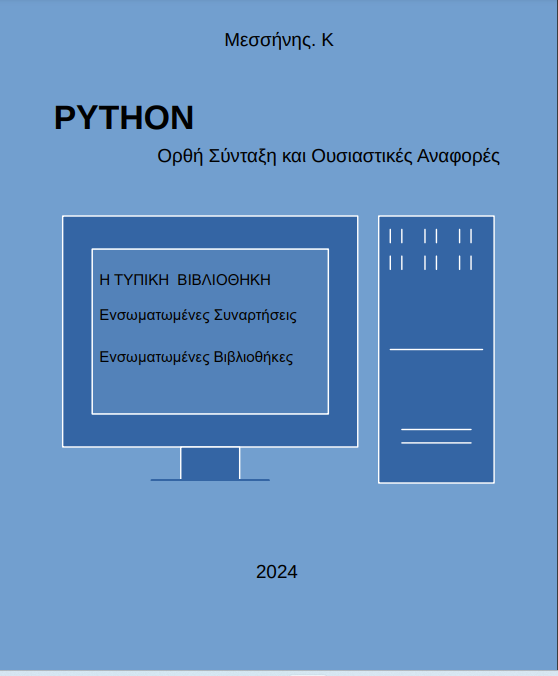

# Python Standard Library
## Υλικό απο το βιβλίο  
### Με τίτλο :"PYTHON"  και υπότιτλο:&nbsp;&nbsp;&nbsp; "Ορθή Σύνταξη και Ουσιαστικές Αναφορές "
<ul>
<li>"Η ΤΥΠΙΚH ΒΙΒΛΙΟΘΗΚΗ"</li>
<li>"Ενσωματωμένες Συναρτήσεις"</li>
<li>"Ενσωματωμένες Βιβλιοθήκες"</li>
</ul>
# Εξώφυλλο 
